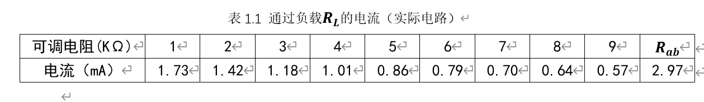
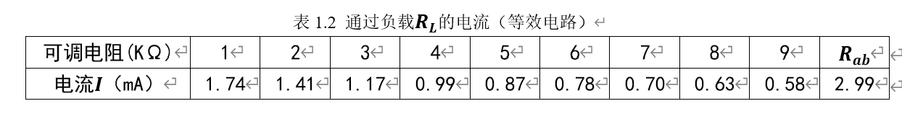
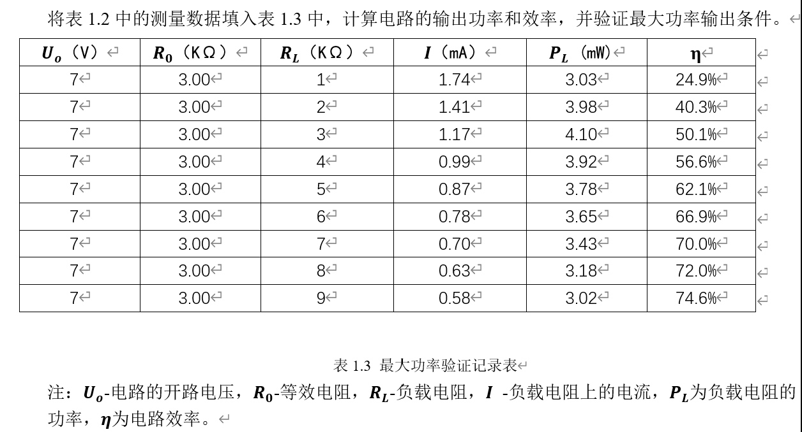

# 《电路信号与系统》实验报告1

在code文件夹里可以直接查看实验报告和相关代码。

## 实验名称：电阻电路

1. 验证戴维南定理：Rab是通过测量出的电流反推电路中的等效电阻，取平均值计算得实际电路中的等效电阻。
   
   计算Rab的python代码

   ```python
    b=0
    a=[1.73,1.42,1.18,1.01,0.86,0.79,0.70,0.64,0.57]
    for i in range(len(a)):
        b+=6.97/a[i]-i-1
    print(b/len(a))
    ```

    
    计算Rab的代码同上，只要改变列表a的值即可
2. 验证最大功率传输定理：
    
    计算效率和功率python代码

    ```python
    while True:
        #依次输入每一行的I和RL
        a=float(input("输入：I"))
        b=int(input("输入：RL"))
        print(PL：a*a*b)
        print(效率：a*b/7)
   ```

3. 绘制图像：负载功率随负载电阻变化的曲线
   先把上面的表格改为csv格式

   ```csv
   U_o（V）,R_0（KΩ）,R_L（KΩ）,I（mA）,P_L (mW),η
    7,3.00,1,1.74,3.03,24.9%
    7,3.00,2,1.41,3.98,40.3%
    7,3.00,3,1.17,4.10,50.1%
    7,3.00,4,0.99,3.92,56.6%
    7,3.00,5,0.87,3.78,62.1%
    7,3.00,6,0.78,3.65,66.9%
    7,3.00,7,0.70,3.43,70.0%
    7,3.00,8,0.63,3.18,72.0%
    7,3.00,9,0.58,3.02,74.6%
   ```

    接下来绘制图像：

   ```python
    import pandas as pd
    import matplotlib.pyplot as plt
    #设置中文
    from pylab import mpl
    mpl.rcParams["font.sans-serif"]=["SimHei"]
    mpl.rcParams["axes.unicode_minus"]=False
    # 读取CSV文件
    df = pd.read_csv('d:\\VS_Projects\\VScode_Python\\奇奇怪怪\\计算\\1.csv')

    # 提取第三列（R_L）和第五列（P_L）
    r_l = df['R_L（KΩ）']
    p_l = df['P_L (mW)']
    plt.figure(figsize=(10, 6))

    # 绘制折线图
    plt.title('负载功率随负载电阻变化的曲线',fontsize=30)
    plt.plot(r_l, p_l, marker='o', linestyle='-', color='b')
    plt.xlim(left=0,right=10)  # 设置 X 轴最小值为 0
    plt.ylim(bottom=0,top=5)  
    plt.xticks(r_l)


    # 显示网格
    plt.grid(True)

    # 显示图表
    plt.show()
    ```

4.误差分析：
    实验中可能出现的误差有很多种，如仪器误差等系统误差，人为因素等偶然误差都有可能影响实验结果的测定。
    测量电压偏小：在实验的过程中，在开关关闭的一刻，电源的示数由9V、5V变为8.996V和4.996V，可能是电源内阻所引起的在输出的时候就偏小。其次，在电压表直接接入电路后，电压表内阻导致测量时电路的电流减小，使得示数偏小。
