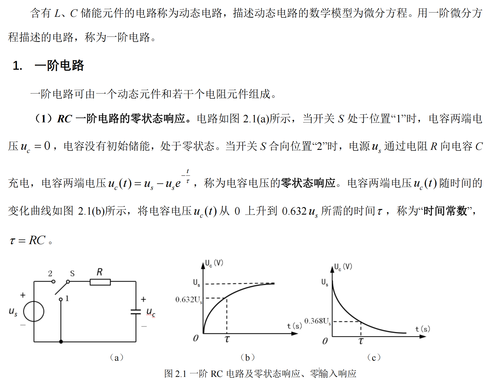
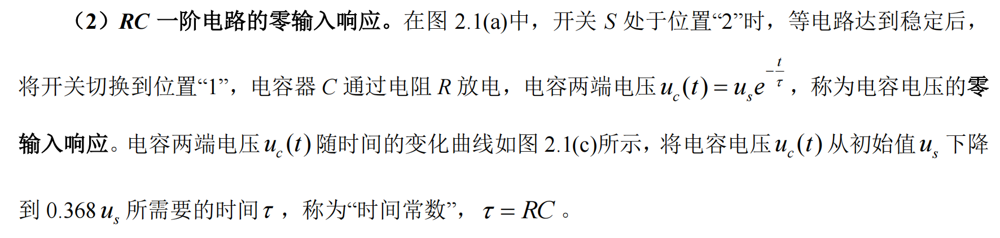
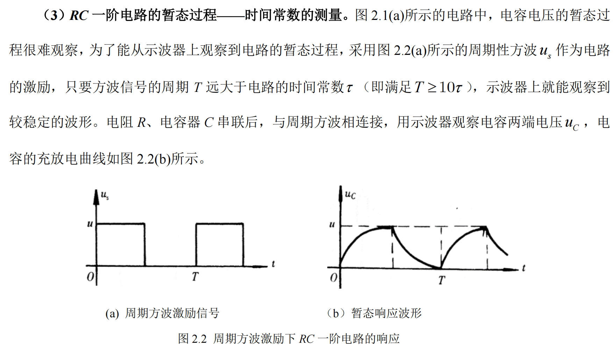
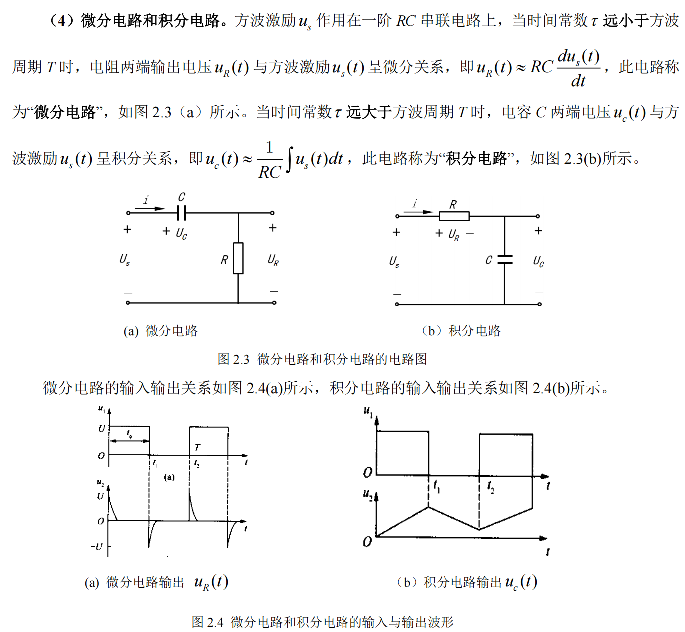
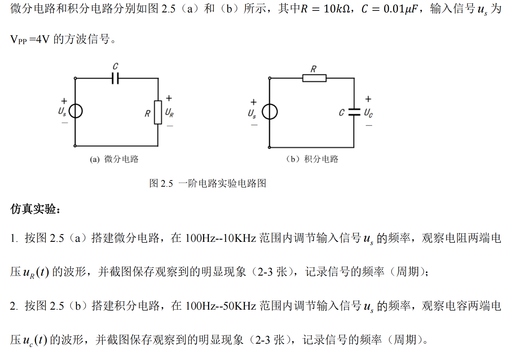
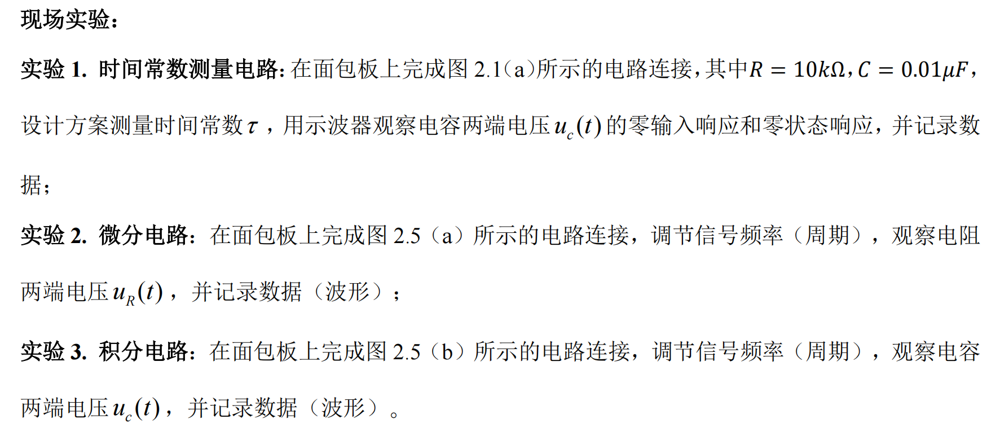

# 实验2：一阶动态电路与时域分析

仿真文件和运行时截图在“仿真实验”文件夹中

实验报告还在编写中，敬请期待。

## 一. 实验目的

1. 研究 RC 一阶电路的零输入响应、零状态响应和全响应的规律和特点；
2. 学习一阶电路时间常数的测量方法，了解电路参数对时间常数的影响。

## 二.实验原理

## 三.实验内容

1. 仿真实验
   仿真文件和运行时截图在“仿真实验”文件夹中
   
   
   
2. 现场实验

   

## 四.思考题

1. 根据 值的物理意义，计算时间常数 ，并与实验测量值进行比较，分析二者出现差异的原因。

2. 观察电路的零输入响应和零状态响应时，为什么激励必须是方波信号？

3. 在 *RC* 一阶电路中，当电阻 *R*、电容 *C* 的大小变化时，对电路的输出（响应）有何影响？